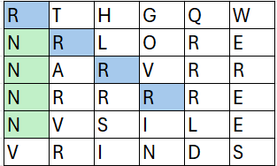
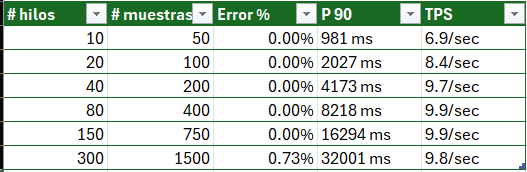
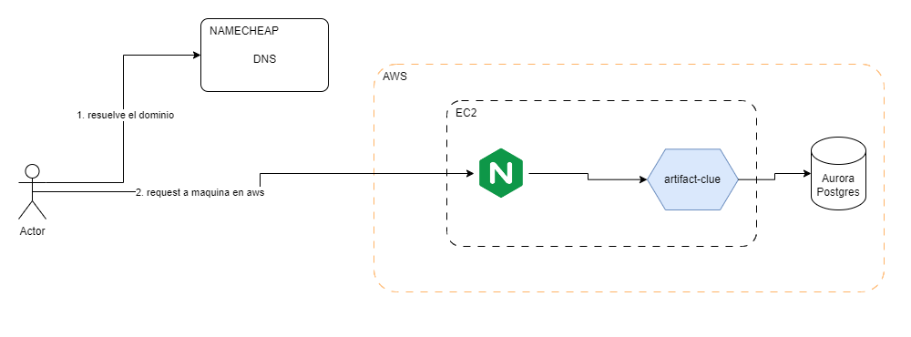
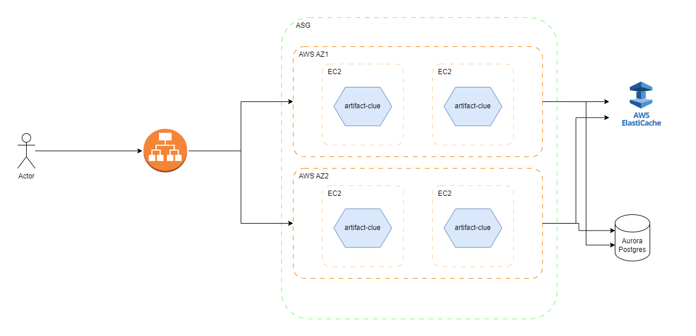

# Prueba técnica: Artifact Clue

Este proyecto es solución a un problema planteado en una prueba técnica.

El objetivo es descubrir pistas sobre la
ubicación de un artefacto, las pistas están dadas por:

- secuencias de 4 letras consecutivas en cualquier dirección (Horizontal, vertical o diagonal)

El proyecto recibe un manuscrito de la forma:

```java
String[] manuscript = {"RTHGQW", "XRLORE", "NARURR", "REVRAL", "EGSILE",
        "BRINDS"};
```

Cada item del arreglo es una linea, y representada en una matriz quedaría como la imagen de abajo.



## Requisitos

- Java 21
- Postman
- Jmeter

## Probar el proyecto

Puedes clonar el proyecto asegurandote de cumplir con los requisitos mencionados.

### Instalación en tu máquina

1. Clonar el proyecto

```bash
git clone https://github.com/berracode/tech-test-artifact-clue.git
```

2. Ejecutarlo

```bash
$ ./gradlew bootRun # en Linux o Mac
$ .\gradlew.bat bootRun # en windows
```

### Prueba la aplicación desplegada en AWS

Puedes probar la aplicación desplegada de la siguiente forma:

1. Importar la colección de postman: [Colección postman](test/postman/tech-test-galatea.postman_collection.json)
2. Ejecutar la request: **analyze manuscript pdn**, puedes probar diferentes cuerpos de
   petición: [Diferentes cuerpos de petición](test/dataset)
3. Las estaidisticas de la ejecucón del endpoint **analyze manuscript pdn** las puedes verificar con la request  **stats
   pdn** o en la siguiente URL: **https://artifact.clue.ritallus.com/clue/stats**

## Prueba de performance

Se realizaron pruebas de performance de la aplicación son una instancia EC2 en aws con las siguientes características:

- vCPU: 1
- RAM: 1,0 GiB

### Resultados de las pruebas:

Al ser una maquina limitada de recursos, los resultados son concluyentes, está solución actual no podría soportar 1M de
peticiones por segundo.



Se observa entonces que:

- hasta 150 hilos con 750 muestras da un error del 0% y un P90 < 17s
- En de 300 hilos con 1500 muestras arroja 0.73% de errores y el P90 sube a 32s.
- El TPS se estabiliza cerca de 10 peticiones/segudo desde 40 hilos.

### Métricas adicionales

- Throughput (TPS): X peticiones/segundo

## Diagrama de solución

### Diagrama actual

Es el diagrama de solución actual, sin embargo, se plantea otra solución para darle manejo a 1M de request por segundo (
Ver diagrama version 2)



### Diagrama version 2:




